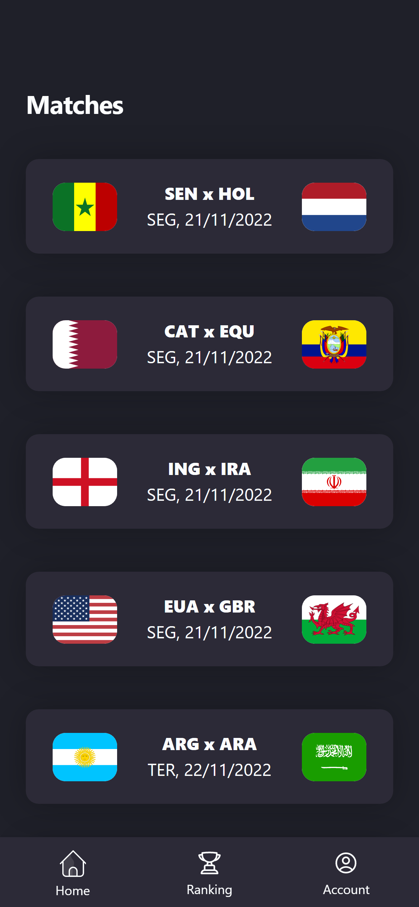

# The App
## **1. Description**
World Cup BetApp project for software engineer class (dcc072), a web application made with NEXTJS and FLASK. This program supports two kinds of users: gamblers and one  administrator. In general, gamblers can make bets and compare score with other users in a rank. The administrator is responsible for the registration of the match real results. There also are other features like delete bets and change username. 

<br/>
<h3 align="center">Gamblers</h3>
<br/>

<p align="center">

  
  


</p>


<br/>
<h3 align="center">Administrator</h3>
<br/>

<p align="center">

  


</p>

<br/>

## **2. How to run**

### **Environment setup**
You'll need some packages in your machine to be able to run this project. You can install using the commands below:

```bash
sudo apt install python3.10-venv
sudo apt install nodejs
sudo apt install npm
npm install --global yarn
```

### **1° Step: Running the server (backend)**
Open your terminal and switch to the project directory. Then, inside flask-backend folder, run the following commands:

```bash
python3 -m venv venv
source venv/bin/activate
pip install Flask
```

This is going to download all the files required by Flask to run the project locally.

Now, to start the server all you need is:
```bash
python3 app.py
```
### **2° Step: Running the client (frontend)**

In another terminal, open the next-frontend folder. Install all the node packages using: 

```bash
yarn
```

And finally, to run the frontend use:
```bash
yarn dev
```
That's it! Let's gooo 
